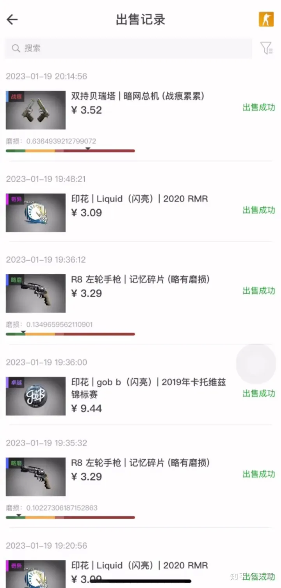
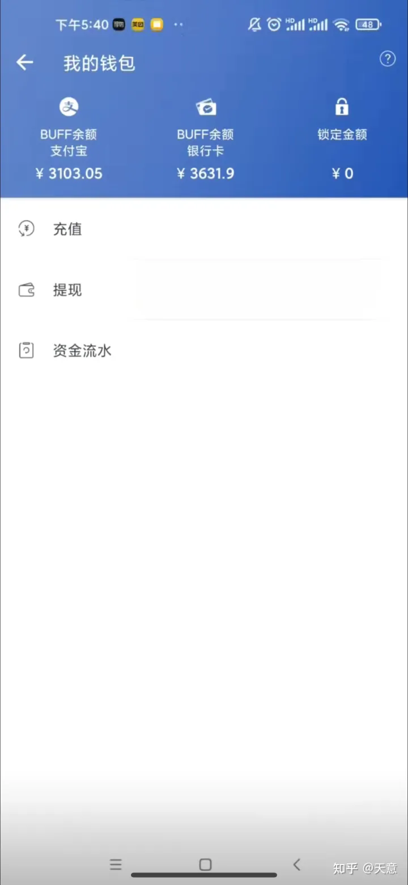
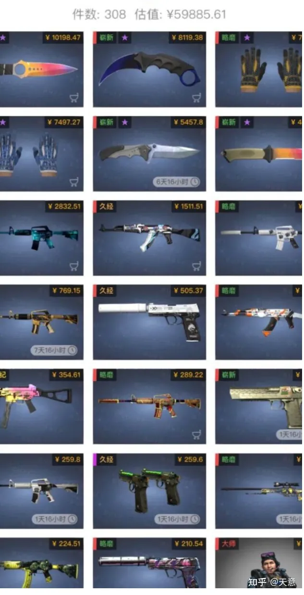
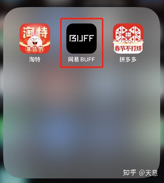
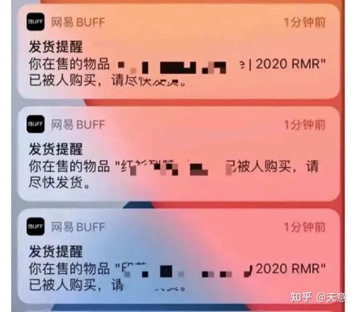
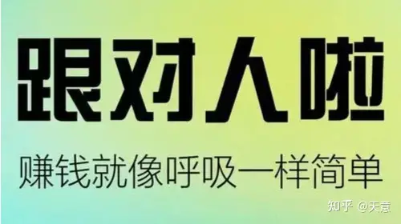

## CSGO游戏饰品搬砖倒卖

起初：我前期也是小金额操作的，目的是为了测试下项目可行性，

我做第一个月的时候，什么都不太懂的我，就小赚了6000+

随着收益越来越高，对项目理解越来越深入，胆子也大了起来，心中也有一杆秤，看下我库存情况

我们做的就只是在国外平台上买道具，再拿到国内平台上去卖，门槛特别低，说白了，就是**低成本创业！**

不需要资金、也不需要什么技术，更不需要你有什么经验，小白一样都可以上手，当然了，如果能组成团队去做，肯定赚的更多！

说白了，与其说是靠信息差赚钱，不如说是靠**汇率差赚钱**！

**有人问，Steam搬砖是啥？**
其实就是利用海外平台的汇率来赚取中间的差价，游戏道具搬砖就是买进游戏道具，卖出游戏道具，不需要其他操作。
Steam游戏搬砖流程：**在Steam游戏平台购买游戏道具，在BUFF道具交易平台卖出。**

Steam搬砖，主要赚的就是汇率差。
当下国际汇率约为1美元=6.9块，但我们通过渠道充值的汇率约为1美元=4-4.7块之间（渠道汇率浮动）。
这样我们充值100美元到Steam平台购买道具，而实际只需要花费约400-470块钱。

举个例子，一件游戏道具，国内国外价格为100美元，也就是市场价约690块钱，但我们买到同样的道具仅需要500块钱左右。因为我们有个礼品卡渠道！100刀的卡500多就可以买到！

然后卖出，中间的差价，就是我们的利润，大概是200元左右。
简单来说就是**低价买进，高价卖出，我们作为中间商，赚差价！**

我们就是用美元低价买商品，再正价卖到国内平台中，中间这个汇率差也就是我们赚的大头！

主要我们有个礼品卡的渠道，500元就能买到100美元的礼品卡，然后用这个礼品卡去平台进货，不需要加价，直接拿到国内平台卖，就能卖到700+，中间这200多的汇率差，就是我们赚到手中的钱！

那么卖给谁呢？我们直接把商品上架到网易BUFFAPP上。

也不用担心卖不出去，我们买的都是市场需求很大的，基本上架的产品，几分钟就能卖出去！

前期可能操作慢一些，赚的没有那么多，一旦跑通了玩法，后期真的是躺着都赚钱！

不少做这个项目的人，自己玩明白之后，都会选择去组建团队，开公司，利润会像滚雪球一样，越滚越大，规模也会越来越大！

别跟我说什么学不会，就问你认不认字儿，会不会电脑最基础的操作，只要这些没问题，就都能做！

而且时间长了，市场的感觉也能轻松掌握，什么商品赚的更多，你心思自然有杆秤！

**那Steam搬砖收益到底能有多少呢？**
拿我自己举例子吧，我现在一台电脑同时操作3个账号，下面的收益是我一个账号的收益，总收益x3就OK啦！
正常情况下，一键装备的收益大约在10%-30%之间，因为利率也是上下浮动的。
市场固定国际汇率1美元=6块9，我们充值只需要4块到4.7块之间。
另外在销售的过程中，采取竞价售卖的方式，也就是所有的卖家自由定价，当然定价越便宜卖的越快。

**那Steam搬砖的成本是多少呢？**
说前期不要成本的，都是忽悠你的，想要做Steam，前期肯定是要充值的。
不过别担心，这个成本不多，而且是实打实能赚回来的。
硬件成本就是一部手机，一台电脑。
**投入成本：**
我们在销售的时候，初始库存只有1000个位置，正常每天可以销售出去200件游戏道具。

资金充裕的朋友，什么利润高买什么就行了，可以把库存充分利用起来，将利润最大化，也可以批量账号操作。

**那Steam搬砖的成本是多少呢？**
说前期不要成本的，都是忽悠你的，想要做Steam，前期肯定是要充值的。
不过别担心，这个成本不多，而且是实打实能赚回来的。
硬件成本就是一部手机，一台电脑。
**投入成本：**
我们在销售的时候，初始库存只有1000个位置，正常每天可以销售出去200件游戏道具。

资金充裕的朋友，什么利润高买什么就行了，可以把库存充分利用起来，将利润最大化，也可以批量账号操作。

**最关键的是，几乎没有门槛，谁都能做，变现速度也快**！

前期稍微投入一些，后期基本就是躺着赚钱，如果时间充裕，完全可以形成规模。

总结，我做过某宝开店，跨境电商，直播，最终都是产品或者客户少出现问题，

这个项目真的非常适合新手小白，而且技术非常成熟

**那Steam搬砖的成本是多少呢？**

说前期不要成本的，都是忽悠你的，想要做Steam，前期肯定是要充值的。
不过别担心，这个成本不多，而且是实打实能赚回来的。
硬件成本就是一部手机，一台电脑。

**投入成本：**

我们在销售的时候，初始库存只有1000个位置，正常每天可以销售出去200件游戏道具。

资金充裕的朋友，什么利润高买什么就行了，可以把库存充分利用起来，将利润最大化，也可以批量账号操作。

这个海外道具搬运项目，就属于轻资产投资，**门槛低、操作模式简单，市场大、风险小**

适合个人或者团队去做，工作室可以大量的操作，这样获利也会更多。

而且很多能人在自己熟练之后，通过自己盈利扩大团队，让利润翻滚起来。从一刚开始一个人做，后面随着盈利越来越多，便开启了公司模式。

**很多人担心，卖不出去怎么办？**

经过我亲身经历，我告诉你，供不应求。。请继续往下看

**那么我是怎么接触到这个项目的呢？**

后来看到一个之前辞职的同事，不知道怎么发了横财，经过我多方打听，才知道他自己在做海外道具搬运项目赚钱，日收入5000多，

起初和你们一样也有怀疑，于是我专门做了一趟实地调研，

为什么我当初会选择他们家呢？如果是单纯线上那种我肯定是不信，但是他们支持实地考察学习！可以现场看他们操作。发现它**总部规模非常之大，不是包皮公司，有非常成熟的线上运营模式！**