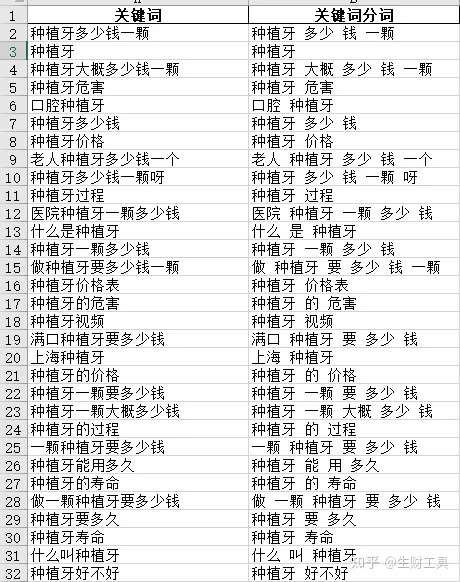
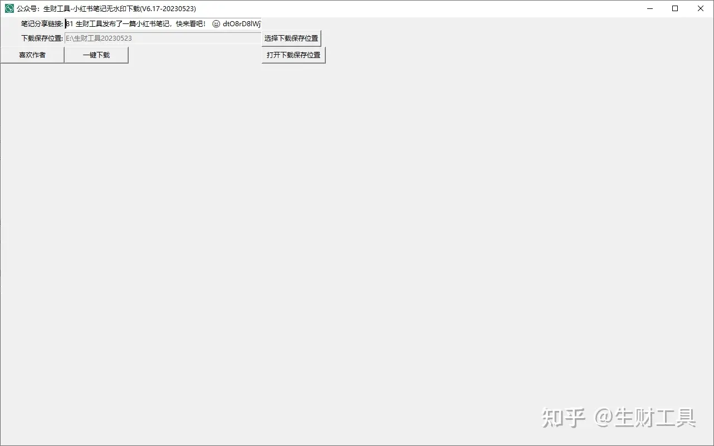

# 自媒体效率提升工具

[生财工具，自媒体效率提升工具，一站式搞定关键词seo、知乎蓝海问答挖掘、小红书、抖音爆款挖掘工具等 - 知乎 (zhihu.com)](https://zhuanlan.zhihu.com/p/644418137)

## 一、软件介绍

生财工具，以关键词为入口，研发分享自媒体运营效率提升工具，包括但不限于关键词工具、小红书、抖音、知乎蓝海问答挖掘工具等。

**任何领域研究好关键词就成功了⼀半！解决核⼼问题就解决了80%的问题，关键词就是核⼼问题。**

生财工具

## 二、关键词工具

### 1、关键词相关词挖掘工具

**1.1 使用场景**
关键词相关词工具适用于挖掘行业、垂直领域的长尾词、细分领域长尾关键词等。
研究关键词，分析用户需求是很多SEO、SEM的从业人员常规操作，一般他们都会到各种工具或平台上拓展长尾词，期望挖掘更多的需求信息。
为了研究关键词，我们需要挖掘尽可能多的相关词，关键词相关词工具挖掘长尾词的原理：给定一个核心词根，将百度搜索的相关词作为相关的长尾词，再将这些相关搜索的长尾词放到搜索，再拿到对应的搜索相关词，不断循环挖掘，就可以挖掘到大量的相关长尾词。

相关词挖掘工具

### 2、关键词网址采集工具

**1.1 使用场景**

关键词网址采集可以根据关键词批量采集在百度的搜索收录的域名、链接以及预估的关键词排名统计。

通过收集细分行业高频搜索词，可以很方便地找到该行业的头部网站有哪些。

**1.2 操作演示**

关键词网址采集工具截屏如下：

关键词网址采集工具

软件根据提供的关键词（可以通过第1个工具批量采集）自动采集关键词在百度的首页搜索结果链接，待采集的关键词如下：

关键词网址采集工具

采集到的相关信息如下：

关键词网址采集工具

**1）文章网址**

文章网址就是把关键词模拟人工拿到百度里面去搜索返回的首页网址链接，采集内容包括：域名、域名描述、链接标题、链接、链接排序预估分数，如下：

关键词网址采集工具

**2）关键词域名统计**

关键词域名统计通过提取关键词的搜索链接域名和链接的排名预估分数，按照域名进行分组统计，我们就能计算关键词对应的域名排名，这些域名就是对应关键词排名靠前的网站：

关键词网址采集工具

**3）关键词域名占比**

关键词网址采集工具

### 3、关键词网页采集工具

**1.1 使用场景**

关键网页采集工具可以根据提供的网页批量采集下载网页内容到本地电脑，可以直接保存为html，也可以剔除网页标签将网页内容保存为纯文本和word格式。

**1.2 操作演示**

关键词网页采集工具

关键词网页采集工具的网页地址文件来源可以直接使用上面的关键词网址采集工具采集即可，采集保存到本地的文纯文本和word示例分别如下：

关键词网页采集工具

关键词网页采集工具

### 4. 关键词筛选工具

**1.1 使用场景**

关键词筛选软件，快速筛选海量长尾词，搭建竞价投放关键词框架，告别宏工具繁琐笨重的分词筛选工作。适用于SEO优化、SEM、竞价投放等筛选关键词。

支持场景筛选规则：批量排除、必须包含指定关键词、关键词长度限制等。

**1.2 操作演示**

关键词筛选工具

关键词筛选工具

### 5. 关键词提取工具

**1.1 使用场景**

从事SEO营销都知道，做好SEO和SEM最重要的事情就是关键词挖掘，挖的词越多，就越有可能发现更多的流量机会。关键词挖掘有很多种方法，这里介绍的是基于海量内容挖词方法，也是目前搜索引擎提取关键词的一种常用方法，专业的技术说法是：**通过TF-IDF算法提取文章关键词**。

关键词提取软件利用海量文本内容来挖词，所谓的文本内容可以是：文章、回答、帖子、新闻等互联网特有形式的文本内容。

1）收集内容

收集一批目标领域的文本内容，比如几万篇以“直播”为主题的文章，以及一批非目标领域的随机文本内容，比如几十万篇新闻文章（这几十万篇可以在不同行业重复利用），可以通过上面的关键词网页采集工具来采集。

2）计算关键词权重

利用TF-IDF算法（是判断文章主题时常见的算法）提取目标领域每一篇内容的高权词，即该目标领域的核心词或关键词。

**1.2 操作演示**

示例：我们预先收集一批直播的网页内容，就可以提取直播行业的关键词：

关键词提取工具

关键词提取工具

### 6. 关键词分词工具

**1.1 使用场景**

关键词分词工具，海量长尾词快速分词，搭建竞价投放关键词框架，告别宏工具繁琐笨重的分词工作。

通过关键词找项目的重点在于挖掘海量用户的需求，再去做自动化归类，数据量越大，归类越智能，找到的需求就越清晰，而分词是关键词挖掘项目的必备操作。

一个简单的分词举例如下：

**怎么下载抖音的视频 --> 怎么、下载、抖音、的、视频。**

当我们拿到一批长尾词，通常需要对长尾词进行分词，统计词根词频，关键词往往符合2/8定律，结合分词统计的词根覆盖率就能**把能覆盖80%词量的20%词根重新进行拓展**，基本就能收集到有代表性的词库。

**1.2 操作演示**

关键词分词工具

关键词分词工具

关键词分词工具

关键词分词工具

### 7. 关键词词根分类工具

**1.1 使用场景**

关键词词根分类工具可以对大量关键词根据指定的词根进行分类，取代笨重速度慢的Excel宏命令操作，百万关键词快速完成分类。

**1.2 操作演示**

使用介绍：

1）词根分类逻辑

假设上海种植牙医院哪家好（种植牙是主词根不分类）可以分成：上海、医院、哪家好。

假如：我认为“医院”为分类词根，那我就优先选择“医院”这个词来分，那在原词表里所有包含“医院”的词，都在”医院”分类里面了。

2）剔除关键词

凡是包含删除词根的关键词都不参与分类。

3）不可分割词

为了提高分词的准确性和满足用户特殊分词的需求，有些词我们希望不被拆分成两个词，比如：价格表，这个词不希望被拆分为：价格，表，两个词，这些词我们可以指定不要拆分开，提高分词的准确性。

关键词词根分类工具

关键词词根分类工具

关键词词根分类工具

关键词词根分类工具

关键词词根分类工具

关键词词根分类工具

### 8. 关键词自动分类工具

1.1 使用场景

在搜索引擎上，找到 50 万个属于某个行业长尾词词库绝对是一种很强的能力，现在我们已经可以通过一些第三词库网站拿到50万甚至更多的词库，但是如果对50万乃至百万级长尾词进行自动化分类，这是有点技术难度的，通过excel基本无法做到，我们其实通过机器学习的文本分类技术是能够在几十分钟内完成**百万级长尾词的分类。**

通过关键词自动分类工具我们可以搭建SEM关键词词库框架：

- **某些词可能只是小部分字眼不同，但实际表述的都是一件事，程序能帮你归类出来。**
- **聚集在一起的一批词，我们一眼就可以看出这是一个什么样的需求，越多越清晰。**
- **相关的已经归类在一起了，后面不会再出现类似需求，不会反复干扰**

1.2 操作演示

关键词自动分类工具

关键词自动分类工具

关键词自动分类工具

关键词自动分类工具

### 9. 关键词清洗工具

**1.1 使用场景**

全网大批量挖掘长尾词，这是seo和sem必须做的事情，但是大批量的长尾词注定会带来一些数据清洗工作，多数情况下清洗的工作可以在Excel完成，但是也有很多情况是Excel很难搞定的,关键词清洗工具借助一定的机器学习算法可以轻松搞定大量长尾词的清洗筛选。

**1.2 操作演示**

操作步骤与技术原理：

1）挑选有代表性的正类与反类词根

正类就是你希望筛选和保留的目标长尾词，反类就是不需要的长尾词。

2）拓展代表性词根

我们挑选这些种子词的目的很简单：“正”的种子词拿到词库里可以筛选出绝对是目标分类的长尾词。

3）AC自动机快速归类

把每一个长尾词拿出来，让每一个种子词跟它比对一次，看看是否包含，进而判断归属分类。

如果有N个长尾词，外层循环就要执行N次，而有M个词汇，N里面的每1次还要包含M次，执行成本可想而知，但是使用AC自动机算法速度就非常快了。

关键词清洗工具

关键词清洗工具

关键词清洗工具

关键词清洗工具

关键词清洗工具

关键词清洗工具

### 10. **关键词思维导图工具**

1.1 使用场景

通过上面的关键词词根分类和自动分类工具归类后的长尾词是没有结构的，一份词库生成之后，你只能从上往下看，看到什么是什么。

其实我们可以使用我们日常工作经常用的脑图工具来可视化呈现关键词的分类效果，**关键字思维导图工具采用关键词根提取法**的方式来归类，使归类好的关键词自动按照思维导图的结构展示出来。

1.2 操作演示

操作步骤介绍：

1）设置思维导图中心词

思维导图中心词就是思维导图的中心节点。

2）设置思维导图层数

可以设置思维导图每一层节点数。

3）多文件模式

当长尾词达到几十万级别时，可以通过多文件模式很方便的查找对应节点长尾词。

| 工具截屏 | 思维导图第1层 | 思维导图第2层 |
| -------- | ------------- | ------------- |
|          |               |               |

## 三、知乎蓝海问答挖掘工具

**1.1 使用场景**

虽然知乎的流量已经落后于抖音、小红书等平台，但是知乎依然是文本领域仅次于百度系的公域流量平台。

通过在知乎回答问题引流到私域，依然是精准的流量渠道。

其实在2020年知乎推出知乎好物带货功能后，当时迅速成为互联网最火热的赚钱项目，只要在知乎回答问题、写文章、上传视频都可以带货，可惜知乎好物这2年的运营的并不成功。

这个工具当时是为了辅助粉丝很少的知乎小白新用户通过挖掘：**回答少（竞争没那么激烈）的问题，流量还行的蓝海问答**，其实这个工具适用于任何想在知乎挖掘蓝海问答的用户，不限于知乎好物回答问题带货。

只要你能在知乎持续挖掘回答：**回答少（竞争没那么激烈）的问题，**这样的问题日积月累的流量就是躺赚，因为一旦你回答了问题，只要不违规，就能通过这些问题不断的从百度搜索、知乎站内搜索获取流量，也许流量不多，但搜索的流量都是精准流量，如果通过合适的引流技巧，将这些流量导流到私有，转化非常可观。

**知乎蓝海问答挖掘工具原理概述如下：**

通过拓展百度相关词的搜索结果，统计搜索结果中的指向知乎问题或文章的链接，统计问题或文章覆盖的长尾词数量，根据统计结果优先回答那些覆盖长尾词数量多，回答人数少的问题，并研究相关的文章进行学习再模仿写作。为了更好的挑选合适的问题回答，工具还爬取了**问题的浏览量、回答中是否已经有知乎好物的回答、问题的关注人数以及文章的点赞数、评论数等指标**。

**1.2 操作演示**

工具会挖掘统计如下文件：

**1） 问题统计文件**

对于问题统计表，提取出预估流量高并且覆盖词数多的问题ID，这些问题都是在百度拥有相对高的流量来源的，优先在这些问题底下推荐才有机会获得更高的曝光量，下面是问题统计的excel截屏：

知乎蓝海问答挖掘工具

我们收集了每个关键词在百度搜索结果中知乎问题的相关指标：覆盖词数量、回答数、浏览量、关注人数已经这个问题是否已经有知乎好物的回答，另外由于关键词的问题太多，根据80/20原则，工具还统计了相关指标TOP20的问题，可以优先选择这些问题进行回答，如下：

- 覆盖词数TOP20的问题统计
- 预估得分TOP20的问题统计
- 问题关注人数TOP20的问题统计
- 问题浏览量TOP20的问题统计

**2）文章统计文件**

对于文章统计表，提取出预估流量高并且覆盖词数多的文章ID。虽然文章是别人发表的，我们也没办法回答，但是可以**研究对方的标题和内容**，知乎在百度的权重已经足够高了，不用担心我们发布的文章不被收录或者排名不好，剩下的就是在比拼标题和内容，**研究对方的标题和内容是如何布局关键词的**，这是文章在百度排名优异的一部分关键，如下：

知乎蓝海问答挖掘工具

和问题统计一样，依然根据80/20原则，工具还统计了相关指标TOP20的文章，可以优先选择这些文章进行模仿创作，如下：

- 覆盖词数量TOP20的文章统计
- 排名预估得分TOP20的文章统计
- 评论数TOP20统计的文章统计
- 赞同数TOP20的文章统计

**3）关键词统计文件**

涉及问题数较多说明该词在目标类目里具有相对代表性，才能在搜索时出现相对多的各种同类问题，同时，如果该词涉及的文章数或问题数较少，或者几乎为0，说明用户目前在百度搜索该词时，还没有能排得上来的好文章，那么显然我们应该以**该关键词为标题，围绕该关键词撰写一篇优质的推荐文章，或者自己提个问题**，用这种方式布局用户可能会搜索到的各种需求,如下：

知乎蓝海问答挖掘工具

## 四、小红书工具

### 1、小红书笔记去水印下载

在小红书找到需要去水印的笔记，然后点击右上角的分享，在弹出的分享面板中，找到：**复制链接**，如下：

小红书笔记去水印下载

打开软件，输入卡密：

小红书笔记去水印下载

小红书笔记去水印下载

点击：**一键下载**，就可以下载笔记的所有去水印图片和笔记的文案内容，如下：

### 2、小红书笔记批量下载

将需要采集的笔记链接保存到文本文件，一行一个笔记链接如下：

小红书笔记批量下载

小红书笔记去水印下载

然后打开软件：

小红书笔记批量下载

小红书笔记批量下载

点击**“开始爬取”，**等待爬取结束后，点击**“打开下载保存位置”**，找到爬取的笔记文字和图片：

小红书笔记批量下载

小红书笔记批量下载

### 3、小红书关键词采集笔记分析

根据关键词搜索笔记，采集笔记，可以采集笔记完整内容，包括笔记标题、笔记正文、笔记点赞数、收藏数、评论数等指标，还可以下载去水印的笔记图片视频，可以根据综合、热度、时间排序采集笔记，同时还可以采集关键词匹配笔记的小红书作者信息包括：昵称、小红书号、小红书等级，发布笔记数等，采集的笔记内容已Excel的形式保存到本地文件，同时会有点赞率等指标的分析等功能，具体操作如下：

小红书关键词采集笔记分析

小红书关键词采集笔记分析

采集的数据示例截屏如下：

**关键词笔记：**

小红书关键词采集笔记分析

**关键词笔记相关用户：**

小红书关键词采集笔记分析

### 4、小红书关键词用户采集分析

通过关键词批量采集小红书垂直领域头部用户的小红书号，我们发现小红书号不是数字的，就是小红书作者的微信号，这样我们就采集了大量微信号，可以方便MCN机构联系小红书博主商业合作，或者添加这些小红书博主微信推广相关产品，等等。

我们先将相关领域关键词保存到文本文件：

小红书关键词用户采集分析

打开软件，点击：**小红书关键词用户采集分析：**

小红书关键词用户采集分析

小红书关键词用户采集分析

采集的小红书博主数据示例如下：

小红书关键词用户采集分析

### 5、小红书用户笔记采集分析

小红书用户笔记采集可以批量采集小红书博主的图文和视频所有笔记，同时下载去水印的笔记图片和视频到本地电脑。

先提取小红书用户主页链接地址：

打开文本文件，将链接复制到文件，如果要同时采集多个博主笔记，文件里每一行放一个博主地址即可：

小红书用户笔记采集分析

打开软件，点击：**小红书用户笔记采集分析菜单**

小红书用户笔记采集分析

小红书用户笔记采集分析

输入采集笔记数量，可以勾选是否要采集笔记完整内容（如果要下载笔记图片和视频一定要勾选）：**开始爬取**，就可以愉快地采集了，采集完成后会有自动提示，点击：**打开下载保存位置**，会自动打开笔记在本地电脑的保存文件夹：

小红书用户笔记采集分析

**笔记统计Excel表格：**

小红书用户笔记采集分析

**笔记去水印图片：**

小红书用户笔记采集分析

### 6、小红书用户收藏笔记采集分析

可以采集用户收藏的笔记，如果用户将收藏的笔记设置为不可见，那就采集不到了。

使用方法跟采集采集小红书用户笔记方法类似，不再赘述：

小红书用户收藏笔记采集分析

### 7、小红书话题笔记采集分析

提取需要采集话题的链接地址，如下：

小红书话题笔记采集分析

将提取的链接放到文本文件，如果同时采集多个话题，一行放一个话题链接如下：

小红书话题笔记采集分析

打开软件，选择上面存储话题链接的文件就可以采集了：

小红书话题笔记采集分析

### 8、小红书笔记评论采集分析

提取笔记链接（参考上面的方法），统计小红书笔记评论高频词，生成词云。

软件操作截屏：

小红书笔记评论采集分析

笔记评论采集内容：

小红书笔记评论采集分析

笔记评论词频统计：

小红书笔记评论采集分析

笔记评论内容：

小红书笔记评论采集分析

笔记词云：

小红书笔记评论采集分析

## 五、抖音工具

### 1、抖音视频去水印下载

复制视频链接：

抖音视频去水印下载

打开软件，拷贝链接地址：

抖音视频去水印下载

点击：**一键下载**

### 2、抖音关键词视频采集分析

根据关键词搜索视频，采集视频，可以采集视频相关信息，包括视频标题、相关词，用户ID，加密用户ID、昵称、视频ID、视频链接、标题、视频标签-作者、视频标签-抖音、点赞数、收藏数、评论数、赞评率、分享数、昵称、签名、作品数、粉丝数、关注数、获赞数、点赞数、视频链接、发布时间等。

1）可以根据综合、热度、时间排序采集；

2）可以限制视频发布时间比如：最近1天内、一周内、半年内发布的视频等，

3）可以采集关键词匹配视频的作者信息包括：昵称、签名、作品数、粉丝数、关注数、获赞数、点赞数等，采集的内容已Excel的形式保存到本地文件，同时会有赞评率等指标的分析等功能。

软件操作示例如下：

抖音关键词视频采集分析

采集的Excel结果如下：

抖音关键词视频采集分析

### 3、抖音用户视频采集分析

抖音用户视频采集功能可以抖音用户所有发布的视频。

在电脑上打开抖音网页版，找到要下载用户，拷贝用户主页网址：

抖音关键词视频采集分析

将网址拷贝到文本文件，如果要同时采集多个用户的视频，一行放一个用户主页网址：

抖音用户视频采集分析

打开软件，选择准备好的用户主页链接的文件，就可以采集了：

抖音用户视频采集分析

## 其他工具

**1、图片素材库**

国内：千图网、千库网、站酷网、花瓣、昵图网、摄图网、视觉中国、全景网。

国外：Unsplash、picjumbo、Life Of Pix、SplitShire、publicdomainarchive、Pexels。

**2、在线制图工具**

创客贴、易图、美图秀秀在线版、PS在线版

**3、视频素材库**

**国内：**

火山、快手、抖音、西瓜、B站、大鱼、企鹅、趣头条、东方头条、凤凰山视频、网易视频、小红书、好看视频、美拍、微博视频、土豆视频、梨视频、微视、波波、伙拍。

**国外：**

youtube 、twitter、facebook、metacafe、vimeo、hulu、viewster、twitch

**4、视频剪辑、特效制作工具**

PR、EDUIS、AE、会声会影、爱剪辑、快剪辑、万兴神剪手

**5、字幕工具**

Aegisub、Subtitle Workshop、Heroglyph、Popsub、傻丫头

**6、视频转码工具**

格式工厂

**7、视频下载工具**

上述国内的视频平台均可以用采集工具进行下载哦。

**8、文章排版工具**

365编辑器、秀米编辑器、135编辑器

**9、数据收集、分析工具**

**10、自媒体必用工具**

文章风险检测工具、原创度检测工具、爆文标题助手

一、音乐、视频、图片素材

1、爱给网：音乐、航拍、延时素材免费下载

2、天空之城：航拍效果的素材网站，各大城市，超清素材，搜索即可获取，都是无版权素材

3、图虫创意：正版图片素材

4、预告片世界：高清预告片

5、Sample focus：高品质音效，英文搜索。免费下载，但次数有限，需要自己上传音频才能下载

6、inshot、巧影：日常音效（笑声音乐掌声风声钟声等）

7、VIDEEZY/Unsplash/pixabay：无版权高清可商用素材

8、STICKPNG/PNGALL/千库网、觅元素：免抠透明背景图片

二、视频制作工具

1、剪映：免费，可加字幕、去视频水印（inpaint可以去除图片水印）,参与话题有流量扶持

2、图虫：专业制作卡点视频

3、QUIK：免费，导入视频利用模板自动生成，可用于制作片头

4、Pr、狸窝、快剪辑、爱剪辑

5、万兴神剪手：好评度高，专业后期，丰富素材

6、威力导演：视频稳定器，海量3D转场效果

7、iMovie：苹果出品，流畅

8、LEGEND、乐秀：文字动画制作片头

9、一闪、inshot：转场丰富，后期配音方便对口型，字幕字体可爱，操作简单，inshot无水印

10、VUE：模板化操作，文艺清新，可做VLOG片头

### 一、【文案神器】

①：梅花网

②：文案狗

③：句子控

④：顶尖文案

### 二、【配音神器】

①：百度文字转语音

②：迅捷文字转语言

③：闪电配音

④：配音阁

### 三、【音乐素材】

①：爱给网

②：耳聆网

③：站长素材

④：1SoundFx

### 四、【图片素材】

①：高图网

②：Pexels

③：Food

④：逗比拯救世界

### 五、【视频素材】

①：沙沙野

②：Pexels

③：设计坞

④：预告片世界

### 六、【图片制作】

①：稿定设计

②：创客贴

③：易图设计

④：图怪兽