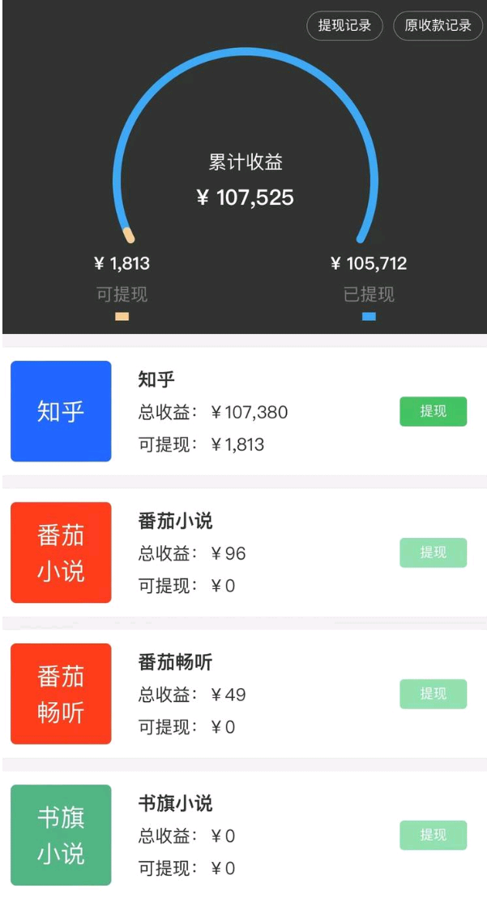
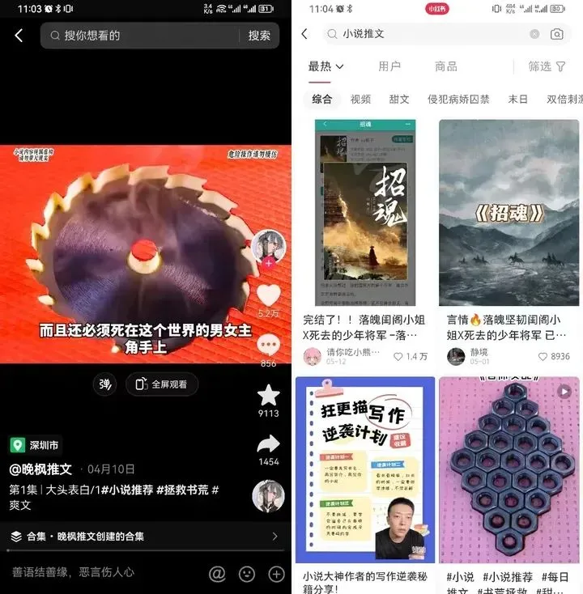
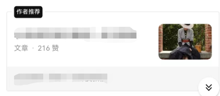
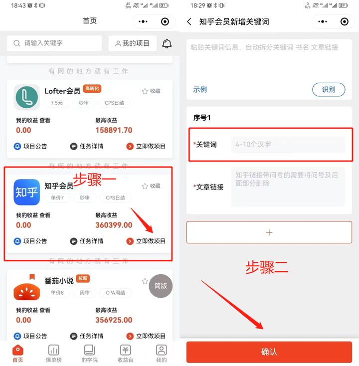
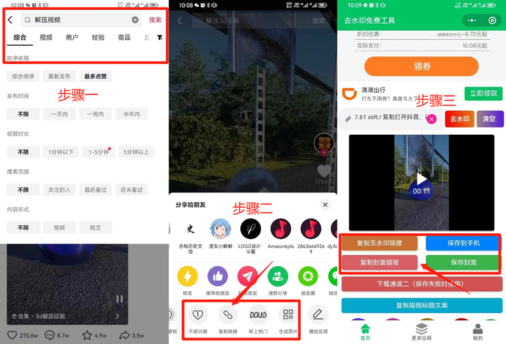
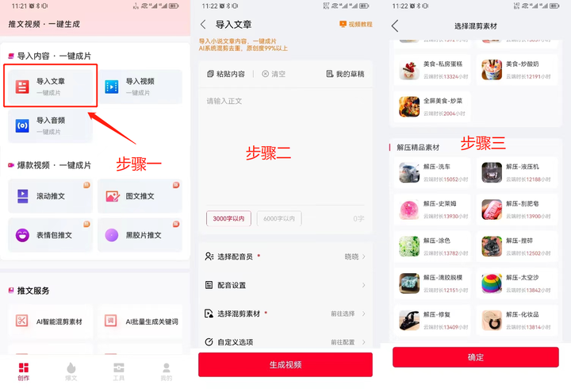

# 小说推文

[小说推文怎么做？赚钱吗？ - 知乎 (zhihu.com)](https://www.zhihu.com/question/545966474/answer/3104383395)

小说推文赚钱很简单，就是找到热度高的书籍，用AI配音制作为视频，把小说推荐出去。

像这种推文视频，播放量一般都是不低的，发布者的一个月收益就可以达到5位数。

制作小说推文不需要很大的精力，我上月刚好研究到了这个，收益很不错，操作流程也不复杂，今天把方法分享给你。

## 一、前期准备

1、目前下方这种视频和图文就是小说推文了。

我们需要先下载；抖音、[小红书](https://www.zhihu.com/search?q=小红书&search_source=Entity&hybrid_search_source=Entity&hybrid_search_extra={"sourceType"%3A"answer"%2C"sourceId"%3A3104383395})、[西瓜视频](https://www.zhihu.com/search?q=西瓜视频&search_source=Entity&hybrid_search_source=Entity&hybrid_search_extra={"sourceType"%3A"answer"%2C"sourceId"%3A3104383395})等，方便推文小说。

**2、获取小说授权**

做小说推文，你需要先获得小说作者的授权，我们只需要注册推文APP，绑定自己的抖音或者小红书，快手账号就可以。

注册推文APP很简单，用[手机号码](https://www.zhihu.com/search?q=手机号码&search_source=Entity&hybrid_search_source=Entity&hybrid_search_extra={"sourceType"%3A"answer"%2C"sourceId"%3A3104383395})就能注册，之后你想要推荐什么小说，APP里操作就行。

获得推文授权平台有：右豹、力推联盟、[抖特](https://www.zhihu.com/search?q=抖特&search_source=Entity&hybrid_search_source=Entity&hybrid_search_extra={"sourceType"%3A"answer"%2C"sourceId"%3A3104383395})等，手机号码注册，手机号码最好和你的抖音等账号一致。

**如果你还没看懂，不知道怎么做，我文章末尾的作者推荐里已经分享，感兴趣可以参考一下**

## 二、准备素材

**1、找[小说素材](https://www.zhihu.com/search?q=小说素材&search_source=Entity&hybrid_search_source=Entity&hybrid_search_extra={"sourceType"%3A"answer"%2C"sourceId"%3A3104383395})**

小说素材可以到：知乎、[番茄](https://www.zhihu.com/search?q=番茄&search_source=Entity&hybrid_search_source=Entity&hybrid_search_extra={"sourceType"%3A"answer"%2C"sourceId"%3A3104383395})、起点等小说平台找热度高、有意思的小说，也可以推荐你喜欢的小说，如果你不想花时间，你可以用我给你推荐的推文工具找近期爆款。

**2、设置小说关键词**

设置小说关键词的意思是：给小说起一个别称。

比如你要推荐《西游记》这本小说，你不能用《西游记》这个名字，需要和作者区分开来，自己起一个新名字来推荐。

起名字没有什么要求，你可以起一个公式化名字，比如我叫惊蛰，你可以起名叫《惊蛰西游》、《[惊蛰三国](https://www.zhihu.com/search?q=惊蛰三国&search_source=Entity&hybrid_search_source=Entity&hybrid_search_extra={"sourceType"%3A"answer"%2C"sourceId"%3A3104383395})》等。

**3、资料回填。**

选择好小说想[好名字](https://www.zhihu.com/search?q=好名字&search_source=Entity&hybrid_search_source=Entity&hybrid_search_extra={"sourceType"%3A"answer"%2C"sourceId"%3A3104383395})后，你需要把准备好的资料，填写到APP后台。

知乎、番茄、起点等小说平台都可以。

把你选的名字和小说链接填写上去。

**4、收集视频素材**

有了小说素材之后，你就可以去收集一些小说的视频素材，比如；解压视频、美食素材、游戏画面等等

画面不需要太吸引人，主要还是靠小说吸引人，画面不引人反感就行。

你可以使用我推荐的APP，里面有很多已经下载好的素材。

你不喜欢使用也可以自己去收集或者下载，我给你提供一个方法：

- 假设我需要收集《[解压视频](https://www.zhihu.com/search?q=解压视频&search_source=Entity&hybrid_search_source=Entity&hybrid_search_extra={"sourceType"%3A"answer"%2C"sourceId"%3A3104383395})》素材。
- 最简单的方法：打开“抖音”，搜索“解压视频”，优先选择最多点赞排序。
- 复制视频素材链接，将视频链接复制到“去水印[工具箱](https://www.zhihu.com/search?q=工具箱&search_source=Entity&hybrid_search_source=Entity&hybrid_search_extra={"sourceType"%3A"answer"%2C"sourceId"%3A3104383395})”去水印下载保存到本地。

**三、制作小说推文视频**

制作视频很简单，你把需要推文的小说复制下来，导入到剪辑软件，选择好一个[机械配音](https://www.zhihu.com/search?q=机械配音&search_source=Entity&hybrid_search_source=Entity&hybrid_search_extra={"sourceType"%3A"answer"%2C"sourceId"%3A3104383395})，然后上传视频画面，等字幕生成之后，就可以导出上传到抖音了。

视频弄好之后，我建议你先自己听一遍时间，看看有没有问题，比如：字幕和音频不同步的情况，你需要自己手动调整。

具体操作都和大家讲了，剩下的就是实操剪辑了！

只需要把小说的高光放到抖音里就能赚钱，还一赚就几百上千，这钱不就是从天而降嘛，不伸手简直对不起自己。