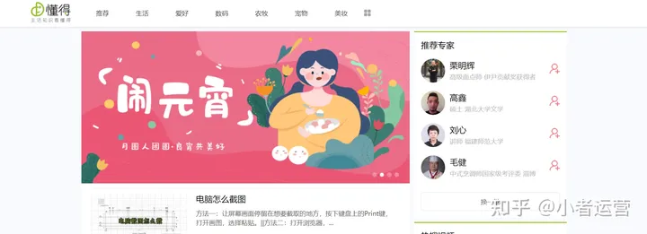
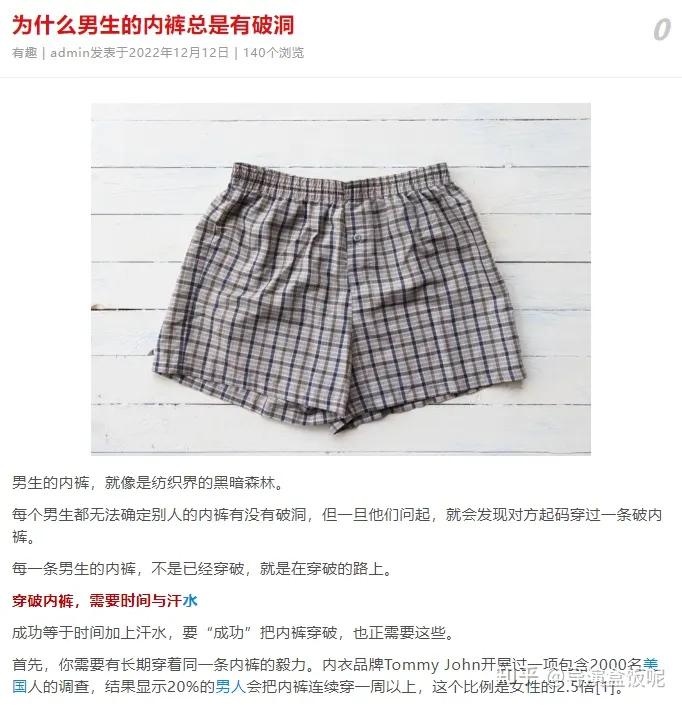
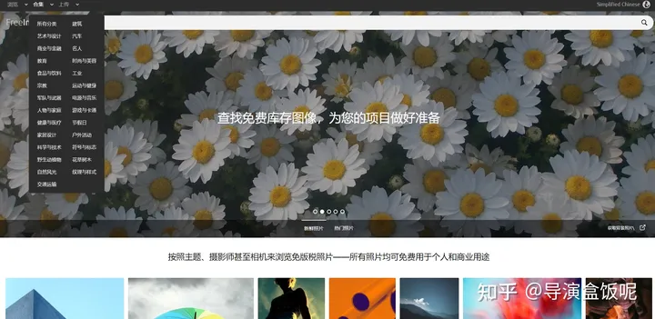

# 知识分享号

## 知识干货收集

[各类干货 - 收藏夹 - 知乎 (zhihu.com)](https://www.zhihu.com/collection/64968519)

[15-城市、交通、区域发展与行政区划 - 收藏夹 - 知乎 (zhihu.com)](https://www.zhihu.com/collection/82865009)

## 生活常识

## 国家网站

## 如何做

[做自媒体知识分享账号，上个月挣了7000多，分享制作方法和技巧 - 知乎 (zhihu.com)](https://zhuanlan.zhihu.com/p/568662551)

接下教大家如何去进行实操，新手开始的时候可能收益不是特别的高，但是大家也不用担心，只要方法是正确的就需要我们去坚持了，毕竟万丈高楼平地起不可能一下就能做的非常好哦！

**第一步、寻找文案**

我们在手机上面的浏览器搜索**“冷知识”，**然后找到合适的文案进行复制

**第二步、用剪辑软件的图文成片功能**

剪辑软件使用的是：**剪映**

****

然后进行更换文本 样式 花字

进行更换模板 声音 等等

修改完成之后，点击导出。

**第三步、注册自媒体账号**

***手机下载一个今日头条APP，注册一个用户账号（如果注册不了，可以先注册西瓜视频）***

******

***注册好账号之后完善一下账号资料***

******

***编辑好资料之后，完成实名认证成为自媒体创作者。（要满18岁）***

******

***实名认证（我们上传的图片只会用来做实名，大家可以放心）***

******

***完成实名认证之后，加入创作者计划（这个非常重要）***

******

***没有门槛，0粉丝就能申请开通“视频创作收益”，之后发视频有播放量就会有收益了。***

**第四步、发布视频**

**1. 打开头条，点击发布，选择视频，点击下一步。**

****

**2.添加封面、标题选择活动 勾选原创**

视频发布成功之后，我们只需要等待第二天视频有播放量就会有收益了，具体的实操今天就分享到这里了，剩下的就是大家自己去进行一些修改和自己的想法。

冷知识号在抖音非常火，一个爆款视频能轻松涨粉几千，而且也有越来越火的趋势，在其他平台同样如此，不仅如此，你也可以把单个作品发到不同平台上，赚取多份收益。

冷知识号做起来容易，但从哪里找素材却让人头疼，今天就给大家推荐几个，好用且免费的素材来源渠道。

一、[冷饭网](https://www.zhihu.com/search?q=冷饭网&search_source=Entity&hybrid_search_source=Entity&hybrid_search_extra={"sourceType"%3A"answer"%2C"sourceId"%3A2863762905})

网站里面包含动物、植物、历史文化、[生活百科](https://www.zhihu.com/search?q=生活百科&search_source=Entity&hybrid_search_source=Entity&hybrid_search_extra={"sourceType"%3A"answer"%2C"sourceId"%3A2863762905})、[未解之谜](https://www.zhihu.com/search?q=未解之谜&search_source=Entity&hybrid_search_source=Entity&hybrid_search_extra={"sourceType"%3A"answer"%2C"sourceId"%3A2863762905})等相关知识，内容涵盖面很广，领域齐全，基本你想找的知识在这里都能找到，对做冷知识分享很有帮助。

二、全历史

想了解历史或者对那段历史有疑惑，到这个网站看过之后你就会豁然开朗，这是一个涵盖古今中外人文历史的网站，可以根据国家或者朝代，看到以时间线整理出来的历史大事件或者历史人物，对大家了解历史有很大的帮助。

三、知妖

对于喜欢研究中国鬼怪传说的人，这个就是宝藏网站，里面收录了 2000 多只妖怪，可以根据怪物外形、好坏、[动植物](https://www.zhihu.com/search?q=动植物&search_source=Entity&hybrid_search_source=Entity&hybrid_search_extra={"sourceType"%3A"answer"%2C"sourceId"%3A2863762905})、体态等等，查询你想要的妖怪，你也可以查看各种[妖怪](https://www.zhihu.com/search?q=妖怪&search_source=Entity&hybrid_search_source=Entity&hybrid_search_extra={"sourceType"%3A"answer"%2C"sourceId"%3A2863762905})的长相和它的来历、背景故事，对于冷知识号也是个宝藏网站。

四、[wikihow](https://www.zhihu.com/search?q=wikihow&search_source=Entity&hybrid_search_source=Entity&hybrid_search_extra={"sourceType"%3A"answer"%2C"sourceId"%3A2863762905})

如果你只想分享些生活小常识，对于哪些专业知识不感兴趣，那这个网站绝对合你的胃口，这里面有各种生活小常识，内容涉及领域众多，绝对量大管饱，在这里找素材绝对比别人更容易起号。

五、[医学微观](https://www.zhihu.com/search?q=医学微观&search_source=Entity&hybrid_search_source=Entity&hybrid_search_extra={"sourceType"%3A"answer"%2C"sourceId"%3A2863762905})

看网站名就知道，这个网站收集了跟医学有关的小知识，对这方面感兴趣的朋友绝对不要错过。

六、懂得

站内包括生活、兴趣爱好、数码、农牧、宠物、美妆、美食、旅游等等生活各方面的冷知识，堪称生活的[百科全书](https://www.zhihu.com/search?q=百科全书&search_source=Entity&hybrid_search_source=Entity&hybrid_search_extra={"sourceType"%3A"answer"%2C"sourceId"%3A2863762905})。

以上就是我分享的素材网站，这些就足够你用了，不管我们是找图片素材、视频素材、还是音效素材，最终的目的都是为了制作出更优质的[短视频](https://www.zhihu.com/search?q=短视频&search_source=Entity&hybrid_search_source=Entity&hybrid_search_extra={"sourceType"%3A"answer"%2C"sourceId"%3A2863762905})。

## 1、冷知识百科：[wikihow](https://link.zhihu.com/?target=https%3A//zh.wikihow.com/%E9%A6%96%E9%A1%B5)

一个堪称百科全书的网站，网站中有很多冷知识，涉及到工作生活中的方方面面！

> 比如，如何对待出轨的女友？ 如何不用上班就能赚钱？ 如何在不学习的情况下通过考试？ 如何做一个赏金猎人？ ......

用一本正经的科学科普，来解释你稀奇古怪的问题。没有它解决不了的，只有你想不到的！

## 2、冷知识素材积累技巧

很多时候好多冷知识素材真的，这时候就需要窍门了。

比如我们做冷知识号，平时肯定关注了不少类似账号。这时候我们可以**针对同一个主题，进行相关的信息收集和整合。**

比如：我们要做一个洗澡唱歌的专题，可能会涉及到洗澡时候为什么要唱歌、为什么很多人觉得洗澡时候唱歌好听等等多个知识点。我们在找到这些视频的时候，可以一键获取他们的全部内容。***工具链接戳：[视频文案提取神器-抖音文案提取工具-录音转文字-牛片](https://link.zhihu.com/?target=https%3A//www.6pian.cn/tq.html)***

生成的文案，可以在线编辑，也可以直接复制。建议多整合类似内容，进行梳理和重新整合使用。切记不可直接照搬，会影响账号原创度的！***工具链接戳：[视频文案提取神器-抖音文案提取工具-录音转文字-牛片](https://link.zhihu.com/?target=https%3A//www.6pian.cn/tq.html)\***

## **3、生活冷知识：**[懂得](https://link.zhihu.com/?target=https%3A//www.idongde.com/)

站内包括生活、兴趣爱好、数码、农牧、宠物、美妆、美食、旅游等等生活各方面的冷知识，堪称生活的百科全书。

比如如何储存大米这种主题，就特别适合生活小妙招号。

## **4、健康冷知识：**[医学微视](https://link.zhihu.com/?target=https%3A//www.mvyxws.com/)

一个由中国医药卫生事业发展基金会和[吴阶平医学基金会](https://www.zhihu.com/search?q=吴阶平医学基金会&search_source=Entity&hybrid_search_source=Entity&hybrid_search_extra={"sourceType"%3A"answer"%2C"sourceId"%3A2801181757})，联合主办的网站。网站内都是一些专业的院士，分享的科普视频。

分类很详细，内容非常非常多，不管你是不是医学生，都可以来这个网站了解一下医学相关的知识！

## 5、冷知识大全：[冷饭网](https://www.zhihu.com/search?q=冷饭网&search_source=Entity&hybrid_search_source=Entity&hybrid_search_extra={"sourceType"%3A"answer"%2C"sourceId"%3A2801181757})

各种奇奇怪怪的冷知识问题都有收录。没有灵感看这个就对了。

其中有趣板块里面净是些奇奇怪怪的问题，但都很有意思，让人想更进一步了解。

## 6、健康冷知识：[默沙东诊疗手册](https://link.zhihu.com/?target=https%3A//www.msdmanuals.cn/)

一个非常专业的医学科普网站，它提供有三个版本，分别是医学专业人士版、大众版、[兽医手册](https://www.zhihu.com/search?q=兽医手册&search_source=Entity&hybrid_search_source=Entity&hybrid_search_extra={"sourceType"%3A"answer"%2C"sourceId"%3A2801181757})，能更精准的解决每一个人的医学问题！

每隔版本中提供的医学主题也有很多，方便我们快速的筛选查询：

## 7、热门冷知识：[极酷](https://link.zhihu.com/?target=http%3A//www.kuoo8.com/html/zhishi.html)

此站主要收录了各种目前大家比较关心的冷知识，适合追热点。

比如KN95和N95的区别

## 8、视频素材：[mixkit](https://link.zhihu.com/?target=https%3A//mixkit.co/)

网站内的素材大多都是一些自然风景、日常生活、动物、食物、节日类的视频，而且视频素材的类别做的很细致。比如自然界这一分类下，分的有天空、大海、花朵、雨、雪......等16个小类别。

视频质量也都还可以，而且很有大片感，遇到喜欢的视频素材，直接下载就完事了。

网站内除了视频资源外，还有音乐、图片、模板、音效等资源：

## 9、视频素材：[videvo](https://link.zhihu.com/?target=https%3A//www.videvo.net/)

超清4K视频素材下载网站，视频素材分类也很丰富，大约25个分类，遵循的协议有免费免版权，也有CC3.0以及署名协议，不过免费免版权的素材都足够我们使用了~

## 10、视频素材：[知鱼素材](https://link.zhihu.com/?target=https%3A//sucai.zhiyu.art/video)

一个原创素材库，它所包含的素材有**两种授权模式**：

> 一种是[共享协议授权](https://www.zhihu.com/search?q=共享协议授权&search_source=Entity&hybrid_search_source=Entity&hybrid_search_extra={"sourceType"%3A"answer"%2C"sourceId"%3A2801181757})，可以商用至任何场景，但是要注意素材是否需要署名； 一种是非共享协议授权，可商用至任何场景，无需署名，但需要给创作者支付授权酬劳；

两种授权模式都可商用，只是条件不一样。

视频的主分类也只有两种：实拍和动态图形，不过这两个大分类下，还有详细的小类别划分。并且还可以按照主色调来检索视频，nice滴很~

网站内不仅仅有视频素材，还有照片、动态图形、[png元素](https://www.zhihu.com/search?q=png元素&search_source=Entity&hybrid_search_source=Entity&hybrid_search_extra={"sourceType"%3A"answer"%2C"sourceId"%3A2801181757})、视频模板、音乐、音效、设计、办公等资源：

视频最大质量可达8K，下载的时候可以查看视频的详细信息：

## 11、视频素材：[coverr](https://link.zhihu.com/?target=https%3A//coverr.co/)

这个网站内的视频素材，都有一种电影大片感，并且免费供个人或商业使用，不需要注册，也不需要归因。

每一个视频下都会有该视频的相关标签，这个是为了方便你检索。当然它的分类做的也很细致，大概有25个类别：

视频质量也很棒，看起来特别有质感和氛围感：

## 12、图片素材： [pixabay](https://link.zhihu.com/?target=https%3A//pixabay.com/)

全球知名的图库网站，拥有上百万张免费正版高清图片素材，涵盖**图片**、**插画**、**矢量图**、**视频**等分类。会实时更新，还支持中文搜索，不过加载速度比较慢，有时候会打不开。

## 13、图片素材：[pexels](https://link.zhihu.com/?target=https%3A//www.pexels.com/zh-cn/)

比较有名的摄影图片社区，堪称图片素材界的网红，主要提供图片和视频。可以按照图片颜色筛选，也可以根据摄影师。

每周定量更新，下载时可自定义大小，加载速度也比较慢，而且还需要英文检索。

## 14、图片素材：[FreeImages](https://link.zhihu.com/?target=https%3A//www.freeimages.com/cn)

图片质量很高的网站，可以按照图片类别和摄影师来筛选图片。它所包含的图片类别有26个，摄影师共有34914名。

包含的图片分类分别是：建筑、艺术设计、商业金融、教育、食品、宗教、花草树木、健康医疗、家居设计、自然风光、户外活动、符号标志、交通运输、动物、军队武器、汽车、名人、时尚美容、工业、运动健身、游戏卡通、节假日、人物家庭、音乐、科学技术、纹理样式....

## 15、音效资源：[小森平音效](https://link.zhihu.com/?target=https%3A//taira-komori.jpn.org/freesoundcn.html)

一个有着各种常用音效素材的网站，比如说日常生活中关门声、扫地声、水龙头声；人的脚步声、打嗝声、剪指甲声；体育馆的吵吵嚷嚷、哨子声、广播声、学校铃声......

网站内的音效都是免费免版权的，对于一些禁止的行为，网站也给出了详细的说明：

## 16、音效资源：[freepd](https://link.zhihu.com/?target=https%3A//freepd.com/)

一个免费无版权的音乐素材库，网站的设计也很有意思，用表情表示音乐的情绪，每一个表情都代表着不同类型的音乐。

这些音乐都是可以在线试听和下载的，我是配合idm来下载的，点击“下载”按钮很快就能下载该音乐！

## 17、爆款配音：[牛片智能配音](https://link.zhihu.com/?target=https%3A//peiyin.6pian.cn/)

一个仿真人度很高的AI配音网站，网站内的AI声音，可以添加情绪，为AI赋予喜、怒、哀、乐、恐惧、亲切、尴尬.....等情绪。

在编辑页面，支持影视解说模式、自定义背景音、特效音、变声、调节语速、智能调节语气、智能断句、[多音字纠错](https://www.zhihu.com/search?q=多音字纠错&search_source=Entity&hybrid_search_source=Entity&hybrid_search_extra={"sourceType"%3A"answer"%2C"sourceId"%3A2801181757})、多人对话、主播切换....等功能。地址是：[抖音电影解说一哥-男声免费在线配音-牛片网](https://link.zhihu.com/?target=https%3A//peiyin.6pian.cn/peiyin/1526.html)

部分AI声音，还可以查看大V使用案例，比如这个抖音一哥的声音，就有10位抖音博主推荐使用过：

网站内的声音类型也很多，有企业宣传、广告促销、新闻资讯、情感语录、影视解说、美食制作、好物推荐等多个声音场景....听起来都很自然。

**7、[百度贴吧](https://www.zhihu.com/search?q=百度贴吧&search_source=Entity&hybrid_search_source=Entity&hybrid_search_extra={"sourceType"%3A"answer"%2C"sourceId"%3A2321931145})—冷知识吧**

**各种你不知道的冷知识都在这里**