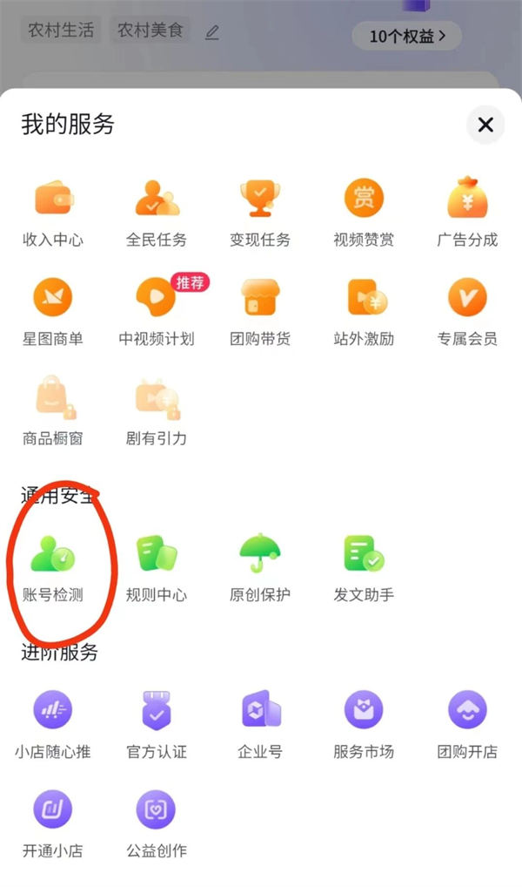

# 自媒体相关问题

## 问题

### 1、可以刷粉刷赞吗

不可以，抖音的检测机制是可以检测到账号异常行为的，只有被推荐的作品能有大量的操作行为（点赞，评论，转发，收藏），这个算正常行为。你刷了一群假粉丝，这群人会给你的作品点赞吗？

### 2、搬运可以火吗

不可以，如果是纯搬运，被检测到后作品就不会被推荐，可以模仿翻拍。

### 3、发第二遍会火吗

未必，但也有这种情况发生，可以优化标题、封面、内容和背景音乐，让视频更有机会火起来。

### 4、被限流怎么办

如果发了段时间，作品播放量都不高，抖音又没有限流通知，那你就要尝试更换视频风格了，创作出更优质的内容。

### 5、视频审核要多久

一般情况几分钟就好了，如果作品内容又争议可能会久一些，最多不超过半小时。

### 6、视频发不出去怎么办

首先查看你的视频内容有没有违规，是否有水印或者搬运，如果不确定可以随便拍个视频，还是发不出去就可以排除作品违规。

要么就是你的网络或者设备有问题，要么就是账号有问题。建议发布作品前开飞行模式换ip，再拍摄一个视频dou+测试是否正常，如果还不能过审核基本就是设备和账号的问题。账号前期需要养号，设备可以恢复出厂设置。

[做自媒体不赚钱了，有多少人是月入过千的？ - 知乎 (zhihu.com)](https://www.zhihu.com/question/62590967/answer/979217655)

[自媒体有月入过万，如何做到的？ - 知乎 (zhihu.com)](https://www.zhihu.com/question/358597167)

[自媒体真的月入过万，但我为什么不做了？ - 知乎 (zhihu.com)](https://www.zhihu.com/question/432095353)

[我想将YouTube上的视频搬运到B站，该怎么跟原作者说，又该如何搬运（新手勿喷）？ - 知乎 (zhihu.com)](https://www.zhihu.com/question/305886916/answer/3002030902)

[哪种类型的抖音号容易赚钱？ - 知乎 (zhihu.com)](https://www.zhihu.com/question/355317826/answer/2373000046)

## 短视频提升播放量的核心技术

找十个几百万粉丝的号

把他们最好的几个文案抄下来，拍30条

每天发两条，凑够九条之后，发两条隐藏两条点击量最少的

你们可以照这样做，一个月后在来回复

------

一般来说，发够七天的视频就不会再给流量了。这个时候发两条视频，然后隐藏两条点赞和点击最少的作品。一个是整体显示的作品的数据上升，一个是用户看到的都是筛选过的流量高的作品。

- 抖音短视频正常一个礼拜后就不会给流量了。他系统规则里面，现存和隐藏作品的数据，都是一个权重值，隐藏作品数据的权重值肯定要比现存的低。把数据差的隐藏掉，等于是把现存作品的分母减少

【注：重发的视频要进行剪映，使之变成另外一个原创视频。否则容易被封号】

三十个视频都有高流量的话，就要进行下一轮的拍摄

一般来说，发够七天的视频就不会再给流量了。这个时候发两条视频，然后隐藏两条点赞和点击最少的作品。一个是整体显示的作品的数据上升，一个是用户看到的都是筛选过的流量高的作品。

### 一

大家做抖音，最重要的就是播放量，这个问题困扰了很多人，有的人发现，自己注册完抖音之后，发的作品播放量，始终小于200，不管发啥作品都是小于200，这种情况，毫无疑问，**你的作品一定是有违规，被限流的**，那么这个时候我们要怎么做呢?

首先，打开自己的创作者服务中心，然后点通用安全，里面有一个账号检测，检测完了之后，他会把你违规的作品直接标出来，常见的原因，可能是作品里边有敏感词，什么叫敏感词呢?就是抖音不允许发的一些内容。

还有一个，就是你的视频原创度不够，作品涉嫌抄袭，我们把违规的作品删了之后，再发十条随手拍的原创风景视频，违规限流就会被解除，但是注意，这十条视频，不要连续发，每天作品的间隔时长，要大于两个小时。

### 二

如果你发的作品，大于200的播放量，但是，小于500的播放量，总是突破不了500，那这个时候，**原因就是你的作品，标签不精准**，系统推荐的人群，根本不爱看你这类视频，所以数据反馈不好，系统会认为你这个作品不优质，他就不会给你大力去推了。

对策就是，我们可以在热点宝里边，去搜行业的关键词，找到爆款榜，那些同行的作品去模仿跟拍，连续发三到五天垂直的作品，就能够给账号打上精准的标签，突破500的基础播放。

### 三

如果你的播放量，发出去之后，在3到5000，那说明你的作品没有太大的看点，虽然突破了基础的流量池，但是，你的作品不能够让更多用户看的非常爽，不能够给你进一步好的数据反馈。

对策就是，我们一定要提升自己的黄金三秒，也叫五秒完播率，抓住别人的眼球，让观众先留下来。我们就要学会用热点话题去蹭热度，平台上，每天都有推出热门的话题，我们一定要学会去跟热点，尤其是标题要学会优化，很多人做自媒体，喜欢做标题党，这个是有很大原因的，因为它确实容易火，而且在这个阶段，一定要坚持的更新，不要断更，这非常重要。

### 四

当你的播放量达到1到3万之后，就是每个作品，他差不多都能够突破1万的播放量，达到1到3万，那说明咱们的作品，是有小火的潜质的，是有上热门的几率的，这个时候，我们要做好持续的输出，坚持更新一段时间，大概率就能爆。

所要做的对策就是，继续复刻三到五个，我们之前流量比较好的这种作品，拍的是哪个方向，我们继续沿着这个方向去拍，而且要带同款的话题和音乐去发布，最好在黄金时段去发布，连续发10到15个，大概率，就会有一个上热门，把我们的播放量，再往上长一波，

### 五

当我们的播放量达到5到8万的时候，账号其实已经有了非常大的基础粉丝体量了，有了固定的粉丝群体，但是粉丝群体，总是看你同一类风格的这种视频，他会看腻掉，所以你会发现，已经很难进一步的去突破更高的流量池了，那么这个时候怎么办呢?

我们就要去蹭热搜榜的大火的那种话题，让粉丝看上去眼前一亮，耳目一新的那种感觉，这招对于提升播放量来吸纳更多的新粉丝，提升我们作品上热门的概率，是有非常大的帮助的。

### 六

当我们的作品突破10万的流量池的时候，就会有大量的精准粉丝，而且，我们的内容一定是有实质性的看点或者本身是非常优质的干货。

这个时候，我们可以去找准我们比较容易火的这种作品风格，而且要多去参考同行优质的作品内容，去借鉴他们的优点，然后，去复盘我们之前火过的内容的一些风格，给他进行融合处理，这个阶段要重点去优化我们的镜头表现力，持续输出不断更，沿着这个思路走，就能够成就百万大V，这就是整个账号运作以及提升播放量的一个核心要义。
